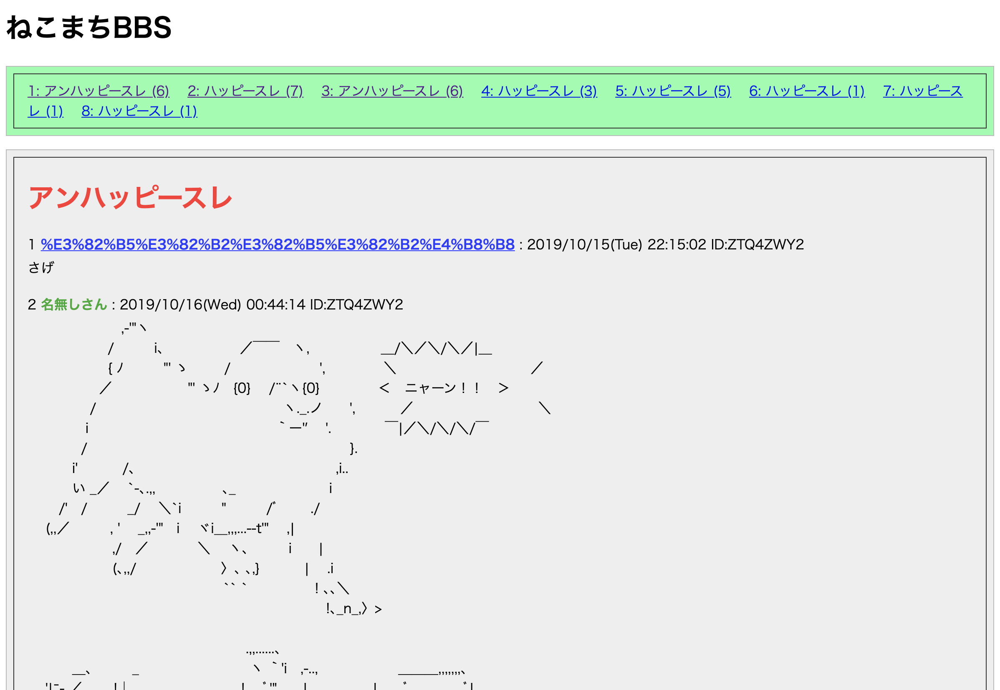

# oldskool BBS



## Run

```bash
$ cargo run
```

## Setup

- install diesel cli: `cargo install diesel_cli`
- use diesel cli to migrate database(SQLite): `diesel migration run --database-url ./<filepath>`

＿人人人人人人人人人人人人人人人人人＿  
＞　おおっと スレッド作る UI がない　＜  
￣ Y^Y^Y^Y^Y^Y^Y^Y^Y^Y^Y^Y^Y^Y^Y^Y^Y^￣

- well, post new thread with cURL

```bash
$ curl -i -X POST \
   -H "Content-Type:application/x-www-form-urlencoded" \
   -d "user_name=サゲサゲ丸" \
   -d "email=sage" \
   -d "body=さげ" \
   -d "title=アンハッピースレ" \
 'http://localhost:8000/threads'
```

- open `http://localhost:8000/` with your brownser and enjoy your happy bbs life
